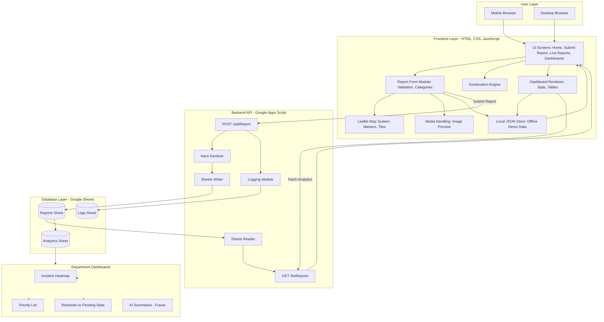

# 🏗️ **LemmeReport — System Architecture**

LemmeReport is a lightweight, mobile-first community safety reporting platform designed for citizens to quickly submit incidents and for municipal authorities to visualize and act on them.
The system uses a **static frontend**, a **Google Sheets backend**, and **minimal JavaScript**, making it hackathon-friendly, low-cost, and instantly deployable.

---



## 📌 **1. High-Level Overview**

```
User → Frontend (HTML/CSS/JS) → Apps Script API → Google Sheets (Database)
                               ↘ Leaflet Map (Visualization)
```

Key goals:

* Fast reporting (low friction)
* No login required (MVP)
* Map-based awareness
* Lightweight dashboard for municipal/police teams
* Runs on any device (browser, PWA-friendly)

---

## 🎨 **2. Frontend Architecture**

### **Technologies**

* HTML5 (all pages in one file or multi-page)
* CSS3 with custom styling + glass UI
* Vanilla JavaScript (no frameworks)
* Leaflet.js for maps
* Local JSON fallback for offline/demo mode

### **UI Structure**

* **Top Navigation / Branding**
* **Hero Panel**
* **Report Creation Modal**
* **Live Map Section**
* **Analytics Cards**
* **Live Reports Feed**
* **Admin Dashboards (Police + Municipal)**

### **Frontend Modules (JS)**

| Module            | Description                                         |
| ----------------- | --------------------------------------------------- |
| `reportManager`   | Handles creation, validation, and saving of reports |
| `mapManager`      | Loads maps, places markers, clusters, heatmap       |
| `uiManager`       | Controls animations, modals, and UI interactions    |
| `demoDataManager` | Generates dummy analytics for dashboard views       |
| `sheetsAPI`       | Sends/receives data from Google Sheets backend      |

---

## 🗺️ **3. Map System Architecture**

### **Map Library**

* Leaflet.js

### **Features**

* Marker clustering
* Priority color coding
* Category icons
* Geolocation support
* Smooth animations on zoom & pan

### **Marker Logic**

| Issue Type     | Marker Color |
| -------------- | ------------ |
| Crime          | Red          |
| Cleanliness    | Green        |
| Infrastructure | Blue         |
| Emergency      | Orange       |
| Other          | Gray         |

---

## 📊 **4. Data Flow Architecture**

### **Submit Report Flow**

```
User fills form
     ↓
validateReport()
     ↓
getLocation() → (optional geolocation)
     ↓
POST to Google Apps Script API
     ↓
Report stored as a new row in Google Sheets
     ↓
Frontend map + dashboard auto-refresh
```

### **Fetch Reports Flow**

```
Frontend loads page
     ↓
GET request → Apps Script endpoint
     ↓
Sheet returns all reports in JSON
     ↓
Map renders markers
Dashboard renders analytics
Live Feed lists newest reports
```

---

## 🧩 **5. Backend Architecture (Google Sheets + Apps Script)**

LemmeReport uses **Google Sheets as the database** and **Apps Script as the backend API**.

### **Backend Components**

| Component                   | Purpose                     |
| --------------------------- | --------------------------- |
| **Google Sheets**           | Stores all incident records |
| **Apps Script Web API**     | Exposes REST endpoints      |
| **Apps Script Deployments** | Controls permissions & URLs |

### **API Endpoints**

#### **POST /addReport**

Adds a new row to the sheet.

#### **GET /getReports**

Returns all rows in JSON format.

---

## 🔐 **6. Security Model**

### **MVP Security**

* Anonymous reporting by default
* No authentication required
* CORS restricted (optional)

### **Data Sanitization**

* HTML escaping
* String length limits
* No personal data collected

### **Future Security Enhancements**

* JWT auth for authority dashboards
* Rate limiting
* Google OAuth for admins

---

## 📈 **7. Analytics & Dashboards**

The system has **two dashboards**:

### **1. Municipal Dashboard**

Analytics include:

* Cleanliness issues
* Infrastructure defects
* Maintenance backlog
* Trends over time

### **2. Police Dashboard**

Analytics include:

* Crime hot zones
* Incident frequency
* Alerts + severity classification

### **Visualization Tools**

* Lightweight CSS cards
* Icons + colors for clarity
* Dummy data supported for demo mode
* Future-ready for real API data

---

## ⚙️ **8. Demo Mode (Offline Analytics + Dummy Reports)**

LemmeReport includes a built-in offline/demo system so judges can see functionality even without the backend.

### **Demo Features**

* Generated reports
* Fake analytics for dashboards
* Simulated resolution status
* Map markers with dummy points

---

## 🛠️ **9. Deployment Architecture**

### **Recommended Deployment**

| Component | Host                            |
| --------- | ------------------------------- |
| Frontend  | GitHub Pages / Netlify / Vercel |
| Backend   | Google Apps Script Web App      |
| Database  | Google Sheets                   |

### **How They Connect**

```
Frontend (Static Hosting)
    ↕ fetch()
Google Apps Script
    ↕ Sheets API
Google Sheets (Database)
```

---

## 🪜 **10. Future Expansion Architecture**

| Feature            | Architecture Upgrade          |
| ------------------ | ----------------------------- |
| User Accounts      | Firebase Auth / Supabase Auth |
| Push Notifications | Firebase Cloud Messaging      |
| Real-time Updates  | Firestore or WebSockets       |
| Proper DB          | MongoDB Atlas or Supabase     |
| Department Portal  | Role-based dashboards         |

---


